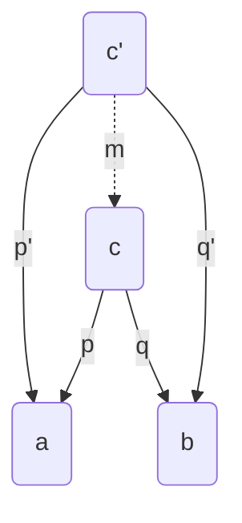
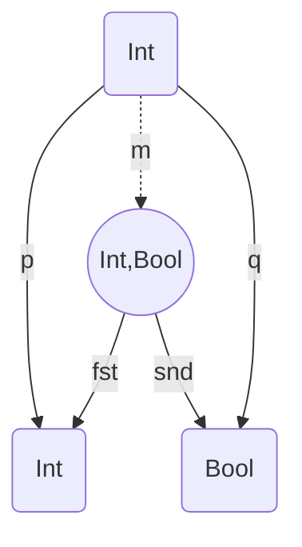
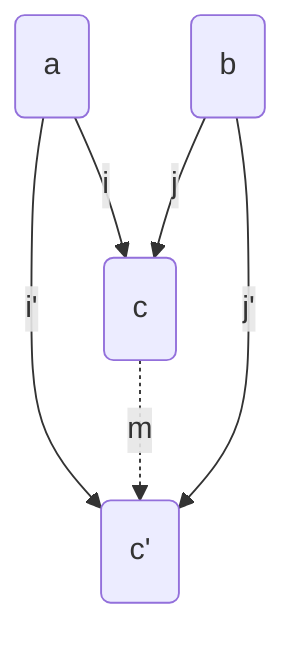

# Programming with Algebras

Stefano Candori

<!--
- Talk from Bartoz, LambdaCon 2015.
- Algebra is the study of variables and the rules for manipulating these variables in formulas/equation
- Algebra of data structures, Algebraic structures
- Category theory trait d'union for interpreting and formalizing  equational algebra and algebraic structures
- Rust examples

https://jrsinclair.com/articles/2019/algebraic-structures-what-i-wish-someone-had-explained-about-functional-programming/

-->

---

## A `monad` is just a `monoid` in the category of `endofunctors`, what's the problem?

_— James Iry_

---

<div class="grid grid-cols-2 gap-4 justify-items-center items-center">
    
    
</div>

---

## You do not need to know <br/>`category theory` to <br/> write `good` functional `code`

<!-- 
functional programming is just compose functions, compose and compose again. 
No mutable data. Pure functions. Don't throw exceptions, don't use (global) state.

So why study category theory? 

Let's start with a metaphore (doing things step by step and abstracting things i know how to do)
-->

---

## `Composition` and `abstraction` are the essence of `human reasoning` 

---

## `Composition` and `abstraction` are the essence of `programming` 

---

## `Composition` and `abstraction` are the essence of `category theory` 

<!-- 
So again study category theory (be pragmatic)? 

Functional programming patterns (algebraic structures) for simplify and 
solve common challenges that we encounter in our code daily, 
such as nullable values, error handling, parallel and sequential 
operations and data validation -> (monoids, functor, applicative, monads, traversable).

Software design patterns were popularised by a bunch of smart people. They observed common approaches to programming problems 
and then wrote books about it. Like design patterns, algebraic structures also represent templates for solving a problem. 
And they can be used in many different situations. Unlike design patterns though, algebraic structures have their basis in mathematics. 

Category theory gives a formalization and allows us to understand and interpret those patterns!

Algebraic structures help us in the same way all other abstractions help us. -->

---

## `Category theory`

1. helps to `understand` how and why things are done in a certain way
2. `unlocks` your abstract thinking
3. lends to extremely useful programming `ideas` which are percolating into every language
4. It's funny and makes me `happy` <uim-rocket class="text-purple-400"/>

---

## A `category` consists of `objects` and `arrows` that go between them

---


---

# Arrows `compose`

---


<!-- 

We don't mind what objects are! flowers? numbers? Chair? boxes? that's ok 

An object in category theory is an abstract nebulous entity. All you can ever know about it is how it relates to other object — how it connects with them using arrows.
In object-oriented programming, an idealized object is only visible through its abstract interface (pure surface, no volume), with methods playing the role of arrows.

To define a category, you have to specify what composition is in that category. It's like the multiplication operation in a group: to define a group, it's not enough to just say you have a set and it is possible to multiply elements of the set; you have to actually say what you mean by "multiply" as part of the definition of the group.

-->

---
layout: image-right
image: /category_laws.png

---

## `Laws`

1. __Identity__ for composition
2. __Associativity__ in composition 

---

### 1-Object Category: `Monoid`


---

### Addition `Monoid`


---

### Category of Sets (`types` + `functions`)


---

# Breathe.

<!-- 
Let summariza a bit

1) Do not despair. In the remainder of the talk we'll simplify a bit and think of arrows, which are also called morphisms, as functions. You have a function f that takes an argument of type A and returns a B. 
Sometimes Objects are types (in programming sense and I assure you this is a category (Hask in haskell)), other times objects
are stuffs like boxes/cones/cilinders/etc.

2) believe or not you'just meet your first algebraic structure. A category is an algebraic structure.

3) An algebraic structure consists of a nonempty set A, 
a collection of operations on A (typically binary operations), and a finite set of laws, that these operations must satisfy. 

But before, let's dig into something a bit different...ADTs!

-->

---

## `Algebrical Data Types`

A type formed by combining other types

1. __Product__ types
2. __Sum__ types

<!-- 
Algebrical data types are not algebraic structure, they only share the name :)

One of the most amazing aspects of mathematics is that it applies to such a wide range of areas.
we'll use elementary school algebra to reason about functional data types. 

-->

---

## `Product`

<div grid="~ cols-4 gap-4">
<div class="col-span-2">

A product of two objects `a` and `b` is the object `c` equipped with two projections such that for any other object `c’` equipped with two projections there is a unique morphism `m` from `c’` to `c` that factorizes those projections

</div>
<div class="col-start-4">

</div>
</div>

---

## `Product`

<div grid="~ cols-4 gap-4">
<div class="col-span-2">

A product of two objects `a` and `b` is the object `c` equipped with two projections such that for any other object `c’` equipped with two projections there is a unique morphism `m` from `c’` to `c` that factorizes those projections

</div>
<div class="col-start-4">

</div>
</div>

<!-- Example of morphism m Int -> (Int, True) -->

---

## `Product`

```rust
struct Point {
    x: u8,
    y: u8,
}

struct Point(u8, u8);
```

Point has `x * y` _(255 * 255)_ possible values


<!-- 

Struct: defines a physically grouped list of variables under one name in a block of memory

A common thing to do in category theory is to reverse all the arrows and see what happens. Doing so for a the product gives us the co-product -->

---

## `Coproduct`

<div grid="~ cols-4 gap-4">
<div class="col-span-2">

A coproduct (sum) of two objects `a` and `b` is the object `c` equipped with two injections such that for any other object `c’` equipped with two injections there is a unique morphism `m` from `c` to `c’` that factorizes those injections

</div>
<div class="col-start-4">

</div>
</div>


<!-- The two injections can either be implemented as constructors or as functions. Let's see an example -->

---

## `Sum` types

```rust{all|2|3|all}
enum Card {
    Number(u8), // injection `i`: u8 -> Card
    Figure(FigureType), // injection `j`: FigureType -> Card
}

// enum FigureType {
//     King,
//     Queen,
//     Jack,
// }
```

Card has `3 + n` _(3 + 255)_ possible values

<!-- type which can be one of a few different variant (unions).  -->

---

```rust

struct Contact1 {
    Address : Option<String>,
    Number : Option<u32>
}

enum Contact2{ 
  AddressAndNumber(String, u32),
  Address(String),
  Number(u32),
}

```

_Contact1_ has `c1 = (s + 1) * (i + 1)` values. <br />
_Contact2_ has `c2 = (s * i) + s + i` values. <br />
But `c1 = (s * i) + s + i + 1`. <br />
So `c1 != c2` (no address provided is not possible in _Contact2_)

<!-- possible in Contact1 {Address = None, Number = None} -->

---

## Make illegal states `unrepresentable`

---

## Phew.
Now, back to `Algebraic` Structures

---


---


---

## `Lift` content into a `context`


<style>
  img {
    height: 460px;
  }
</style>

<!-- 
We we want/need to add some metadata to our content.

we have a triangle, maybe more than one.

We have something which is nullable -->

---

* `Option` _(Maybe)_
* `List`
* `Result` _(Either)_
* `Future`
* ...

---

# `Functor`

placing stuffs into `boxes`

---

## `Lift` content into a `context`


<style>
  img {
    height: 460px;
  }
</style>


<!-- 

back again to this slide. 

Can be seen as a mapping from one category to another.
To be a functor i have to know how to map objects but also how to map arrows/functions!

If i know how to transform a triangle into a square, i must know how to transform a boxed triangle in a boxed square, isn' it?

-->
---

## `Functor`
1. placing stuffs into `boxes`
2. a `mapping` between categories

<v-click>
```haskell
class Functor f where
    fmap :: (a -> b) -> f a -> f b
```
</v-click>

<!-- Ultra quick haskell syntax recap: http://cheat.sh/haskell/Type_signatures 
Curryng: of translating the evaluation of a function that takes multiple arguments 
into evaluating a sequence of functions, each with a single argument. 
-->

---

## `Maybe` Functor

```haskell
data  Maybe a  =  Nothing | Just a

instance  Functor Maybe  where
    fmap _ Nothing       = Nothing
    fmap f (Just a)      = Just (f a)
```

---

## `List` Functor

```haskell
data List a = [] | a : List a

instance Functor List where
    fmap _ []     = []
    fmap f (x:xs) = f x : fmap f xs
```

---


---


---


---

## `Applicatives`
1. applying `lifted` function
2. `combine` more boxes into one
3. fmap with `n-arity` functions

<v-click>
```haskell
class (Functor f) => Applicative f where
    (<*>) :: f (a -> b) -> f a -> f b

liftA2 :: (Applicative f) => (a -> b -> c) -> f a -> f b -> f c
```
</v-click>

---

## `Maybe` Applicative

```haskell
instance Applicative Maybe where
  (<*>) Nothing _ = Nothing
  (<*>) _ Nothing = Nothing
  (<*>) (Just f) (Just x) = Just (f x)
```

<v-click>
```haskell
>> (*) <$> Just 4 <*> Just 5
-- Just 20
>> (*) <$> Nothing <*> Just 2
-- Nothing
```
</v-click>

---


<!-- not a functor, we want to dig into two levels
not an applicative, they are not indipendent boxes, but one inside the other -->

---


---


<!-- a flat + map operation -->

---

# Here you are, `Monads`!
<!-- believe it or not, monad is just flattening boxes. -->

---


<!-- A lot of common, useful computations 
 follow the pattern of performing sequences of tiny computations on values, and monad simply abstract that!

 flatmap: connect the output of one computation to a function that consumes the output and then returns another computation.
 
 -->

---

## `Monads`
1. `flattening` boxes
2. `chaining` computations

<v-click>
```haskell
class (Applicative m) => Monad m where
    bind :: m a -> (a -> m b) -> m b
```
</v-click>

<!-- Every computation depends on the previous.
 bind = flatmap: connect the output of one computation to a function that consumes the output and then returns another computation.
 -->


---

### `Do` notation

```haskell
getUsername path = do
  contents <- readFile path
  username <- readUsername contents
  return username
```
<v-click>
```rust
/// `?` Operator
fn read_username_from_file() -> Result<String, io::Error> {
    let mut username_file = File::open("hello.txt")?;
    let mut username = String::new();
    username_file.read_to_string(&mut username)?;
    Ok(username)
}
```
</v-click>

---

## A `generic` model of `computation` that lets you choose the environmental features that you want for your computations

<!-- 
All monad based environments support a fundamental operations:  bind.
- bind: connect the output of one computation to a function that consumes the output and then returns another computation.

It's just that a lot of common, useful computations follow the pattern of performing sequences of tiny computations on values. And that's what bind let you do. They let you build up useful, complex computations.
Here's where it gets cool. Different monads offer different kinds of environments in which to interpret the computations that you construct. 

For example, the State monad lets you perform computations within an environment in which each computation has access to some blob of state. 

BUT:
If you're accustomed to imperative programming languages, you're probably thinking, "Big deal, I can mix state into my computations already. I don't need monads to let me do it." And you would be right.

But you would also be missing the point. 

Often, you don't need to work with state. And yet most programming languages force you to carry out all of your computations in an environment that makes you manage state anyway, at least in your head. When you don't need it, it's baggage. It's a burden. It's one more thing that can go wrong.

If you're using monads, on the other hand, you can be explicit about when you need and do not need state – and other environmental features. 

NEXT PAGE!

https://www.reddit.com/r/programming/comments/ox6s/ask_reddit_what_the_hell_are_monads/ 

-->

---

## It's all about being `explicit`

 <!-- You can build your environments to perfectly match your requirements. 
 
 (And, if you're using a programming language like Haskell/Rust that offers a 
 modern static type system in addition to monads, you can be assured of never 
 accidentally mixing computations intended for different environments.) 

If you want an environment that supports exceptions, closures, and state, just stack up a few monads, and you've got it. 
If you need continuations, I/O, and a stream of random integers, no problem: just set up a different stack. 

Monad transformers, FTW (we'll see later in the exercise)

 -->

---

## `Summary`
1. `Category Theory` => how things compose
2. `ADTs`            => compose types to make illegal states unrepresentable
3. `Functor`         => lift values into a context
4. `Applicative`     => indipendent values applied to a function in a context
5. `Monad`           => sequencing contextful operations  


---

## Where to go `next`?


