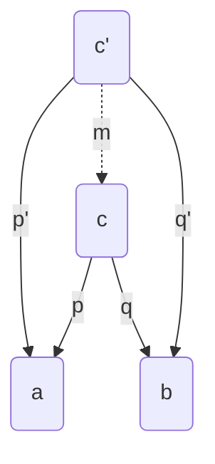
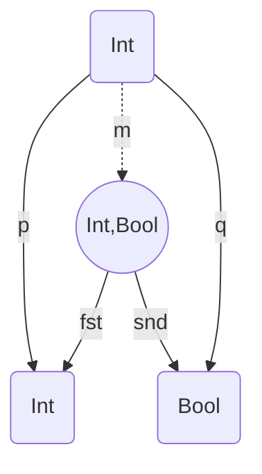
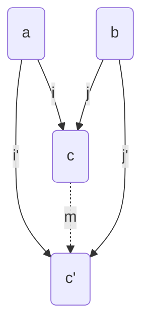

# Programming with Algebra

Stefano Candori

<!--
Algebra and math is present in our everyday programming, mainly in functional programming?
Don't you believe it? Let's go!
-->

---


## A `monad` is just a `monoid` in the category of `endofunctors`, what's the problem?

_— James Iry_

---


---

## You do not need to know <br/>`category theory` to <br/> write `good` functional `code`

<!-- functional programming is just compose functions, compose and compose again. 
Don't throw exceptions, don't use (global) state.

So why study category theory? 

Let's start with a metaphore (doing things step by step and abstracting things i know how to do)
-->

---

## `Composition` and `abstraction` are the essence of `human reasoning` 

---

## `Composition` and `abstraction` are the essence of `programming` 

---

## `Composition` and `abstraction` are the essence of `category theory` 

<!-- 
So again study category theory (be pragmatic)? 

1) Arise of functional programming
2) Functional programming patterns for simplify and solve common challenges that we encounter in our code daily, such as nullable values, error handling, parallel and sequential operations and data validation -> (monoids, functor, applicative, monads, traversable)
3) Category theory explains them all -->

---

## `Category theory`

1. helps to `understand` how and why things are done in a certain way
2. `unlocks` your abstract thinking
3. lends to extremely useful programming `ideas` which are percolating into every language
4. It's funny and makes me `happy` <uim-rocket class="text-purple-400"/>

---

## A `category` consists of `objects` and `arrows` that go between them

---


---

# Arrows `compose`

---


---

## What defines a category is `how` the arrows (morphism) `compose`

<!-- we don't mind what objects are! flowers? numbers? Chair? boxes? that's ok -->

---
layout: image-right
image: /category_laws.png

---

## `Laws`

1. __Identity__ for composition
2. __Associativity__ in composition 

---


---

# Breathe.

---

## `Algebrical Data Types`

A type formed by combining other types

1. __Product__ types
2. __Sum__ types

<!-- One of the most amazing aspects of mathematics is that it applies to such a wide range of areas.
we'll use elementary school algebra to reason about functional data types. -->

---

## `Product`

<div grid="~ cols-4 gap-4">
<div class="col-span-2">

A product of two objects `a` and `b` is the object `c` equipped with two projections such that for any other object `c’` equipped with two projections there is a unique morphism `m` from `c’` to `c` that factorizes those projections

</div>
<div class="col-start-4">

</div>
</div>

---

## `Product`

<div grid="~ cols-4 gap-4">
<div class="col-span-2">

A product of two objects `a` and `b` is the object `c` equipped with two projections such that for any other object `c’` equipped with two projections there is a unique morphism `m` from `c’` to `c` that factorizes those projections

</div>
<div class="col-start-4">

</div>
</div>

<!-- Example of morphism m Int -> (Int, True) -->

---

## `Product`

```rust
struct Point {
    x: u8,
    y: u8,
}

struct Point(u8, u8);
```

Point has `x * y` _(255 * 255)_ possible values


<!-- A common thing to do in category theory is to reverse all the arrows and see what happens. Doing so for a the product gives us the co-product -->

---

## `Coproduct`

<div grid="~ cols-4 gap-4">
<div class="col-span-2">

A coproduct (sum) of two objects `a` and `b` is the object `c` equipped with two injections such that for any other object `c’` equipped with two injections there is a unique morphism `m` from `c` to `c’` that factorizes those injections

</div>
<div class="col-start-4">

</div>
</div>


<!-- The two injections can either be implemented as constructors or as functions. Let's see an example -->

---

## `Sum` types

```rust{all|2|3|all}
enum Card {
    Number(u8), // injection `i`: u8 -> Card
    Figure(FigureType), // injection `j`: FigureType -> Card
}

// enum FigureType {
//     King,
//     Queen
// }
```

Card has `2 + n` _(2 + 255)_ possible values

<!-- tagged union, variant, enumerative -->

---

```rust

struct Contact1 {
    Address : Option<String>,
    Number : Option<u32>
}

enum Contact2{ 
  AddressAndNumber(String, u32),
  Address(String),
  Number(u32),
}

```

_Contact1_ has `c1 = (s + 1) * (i + 1)` values. <br />
_Contact2_ has `c2 = (s * i) + s + i` values. <br />
But `c1 = (s * i) + s + i + 1`. <br />
So `c1 != c2` (no address provided is not possible in _Contact2_)

<!-- possible in Contact1 {Address = None, Number = None} -->

---

## Make illegal states `unrepresentable`

---


---


---

## `Lift` content into a `context`


<style>
  img {
    height: 460px;
  }
</style>

<!-- 
We we want/need to add some metadata to our content.

we have a triangle, maybe more than one.

We have something which is nullable -->

---

* `Option` _(Maybe)_
* `List`
* `Result` _(Either)_
* `Future`
* ...

---

# `Functor`

putting stuff in boxes

---

## `Lift` content into a `context`


<style>
  img {
    height: 460px;
  }
</style>


<!-- 

back again to this slide. 

Can be seen as a mapping from one category to another.

If i know how to transform a triangle into a square, i must know how to transform a boxed triangle in a boxed square, isn' it?

-->
---

## `Functor`
1. placing stuffs into `boxes`
2. a `mapping` between categories
3. a type that can be `mapped` over

<v-click>
```haskell
class Functor f where
    fmap :: (a -> b) -> f a -> f b
```
</v-click>

<!-- Ultra quick haskell syntax recap: http://cheat.sh/haskell/Type_signatures -->

---

## `Higher` kinded types 101


<!-- Before moving on let's dive down into a little detail, to better understand Rust implementation. 

Functor is a HKT!

...and another great explanation https://serokell.io/blog/kinds-and-hkts-in-haskell

-->

---

### `HKT` are not representable in _Rust_

[`GAT`](https://rust-lang.github.io/generic-associated-types-initiative/index.html) allows to simulate them

_(with some hitches)_

---

## Meet [`Algar`](https://github.com/cando/Algar) 

A _Rust_ crate exposing algebric structures, higher-kinded types and other category theory bad ideas

<!-- We'll use code from this library, but don't focuse on code, focus on understading the concepts -->

---

```rust {all|2|3|5-7}
pub trait Functor {
    type Unwrapped; // a
    type Wrapped<B>: Functor; // f b

    fn fmap<F, B>(self, fun: F) -> Self::Wrapped<B>
    where
        F: Fn(Self::Unwrapped) -> B; // (a -> b)
}
```

<!-- and yes Rust has map hardcoded into a couple of structures (Option, Result, Vec, etc.) -->

---


---


---

## `Applicatives`
1. applying `lifted` function
2. `combine` more boxes into one
3. fmap with `n-arity` functions

<v-click>
```haskell
class (Functor f) => Applicative f where
    (<*>) :: f (a -> b) -> f a -> f b

liftA2 :: (Applicative f) => (a -> b -> c) -> f a -> f b -> f c
```
</v-click>

---

```rust {all|2-4|6-8}
pub trait Apply: Functor {
    fn ap<F, B>(self, f: Self::Wrapped<F>) -> Self::Wrapped<B>
    where
        F: FnOnce(Self::Unwrapped) -> B;

    fn lift_a2<F, B, C>(self, b: Self::Wrapped<B>, f: F) -> Self::Wrapped<C>
    where
        F: FnOnce(Self::Unwrapped, B) -> C;
}
```

<!-- 
    // Since Rust doesnt'have (auto)currying, we are forced to manually implement
    // lift_a3, lift_a4, etc.

    // But in Rust we don't neet it, since lift is baked into the language via '?'
    // let a = self?;
    // let b = b?;
    // Some(f(a, b)) -->
---

## `Pure`: how to create a box

```haskell {2}
class (Functor f) => Applicative f where
    pure :: a -> f a  
    (<*>) :: f (a -> b) -> f a -> f b
```

```rust {2}
pub trait Applicative: Apply {
    fn pure(value: Self::Unwrapped) -> Self::Wrapped<Self::Unwrapped>;
}
```

---


<!-- not a functor, we want to dig into two levels
not an applicative, they are not indipendent boxes, but one inside the other -->

---


---


<!-- a flat + map operation -->

---

# Here you are, `Monads`!
<!-- believe it or not, monad is just flattening boxes. -->

---


<!-- There's nothing magic. It's just that a lot of common, useful computations 
 follow the pattern of performing sequences of tiny computations on values. -->

---

## `Monads`
1. `flattening` boxes
2. `chaining` computations (with effects) 

<v-click>
```haskell
class (Applicative m) => Monad m where
    bind :: m a -> (a -> m b) -> m b
```
</v-click>

<!-- Every effect/box depends on the previous -->

---

```rust {all|2-4}
pub trait Monad: Applicative {
    fn bind<F, B: 'a>(self, f: F) -> Self::Wrapped<B>
    where
        F: FnOnce(Self::Unwrapped) -> Self::Wrapped<B>;
}
```

<!-- and_then in Rust is bind! -->

---

### `Do` notation

```haskell
getsUsername path = do
  contents <- readFile path
  username <- readUsername contents
  return username
```
<v-click>

```rust
/// `?` Operator
fn read_username_from_file() -> Result<String, io::Error> {
    let mut username_file = File::open("hello.txt")?;
    let mut username = String::new();
    username_file.read_to_string(&mut username)?;
    Ok(username)
}
```
</v-click>

---

## A `generic` model of `computation` that lets you choose the environmental features that you want for your computations

<!-- https://www.reddit.com/r/programming/comments/ox6s/ask_reddit_what_the_hell_are_monads/ 

Here's where it gets cool. Different monads offer different kinds of environments in which to interpret the computations that you construct. 

BUT:
If you're accustomed to imperative programming languages, you're probably thinking, "Big deal, I can mix state into my computations already. I don't need monads to let me do it." And you would be right.

But you would also be missing the point. 

-->

---

## It's all about being `explicit`

 <!-- You can build your environments to perfectly match your requirements. (And, if you're using a programming language like Haskell/Rust that offers a modern static type system in addition to monads, you can be assured of never accidentally mixing computations intended for different environments.) -->

---

## `Summary`
1. `Category Theory` => how things compose
2. `ADTs`            => compose types to make illegal states unrepresentable
3. `Functor`         => lift values into a context
4. `Applicative`     => indipendent values applied to a function in a context
5. `Monad`           => sequencing contextful operations  

---

## Time to `exercise`

<fluent-emoji-turtle />

_A [`Turtle`](https://en.wikipedia.org/wiki/Turtle_graphics) tale_ 

---

## Where to go `next`?


---

## Bonus: `Foldable` and `Traversable`

